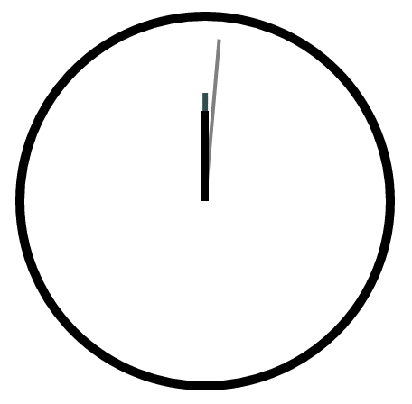
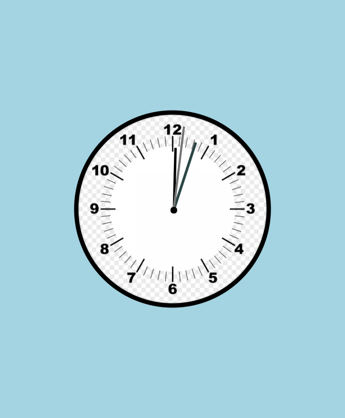

# Practice with Transform, Transitions, and Animations

## Desktop view

## Instructions

There are a couple of things to note:

- You may want to use positioning property for some elements.

- You may also want to use the transform origin property on your animation.

- The hands of the clock in the gif are rotating. Once you've positioned the elements, give it a try if you want.

- If you try to rotate the clock arms, don't worry about getting the exact time right or making the rotations perfect. You can just start with the arms all at noon.
